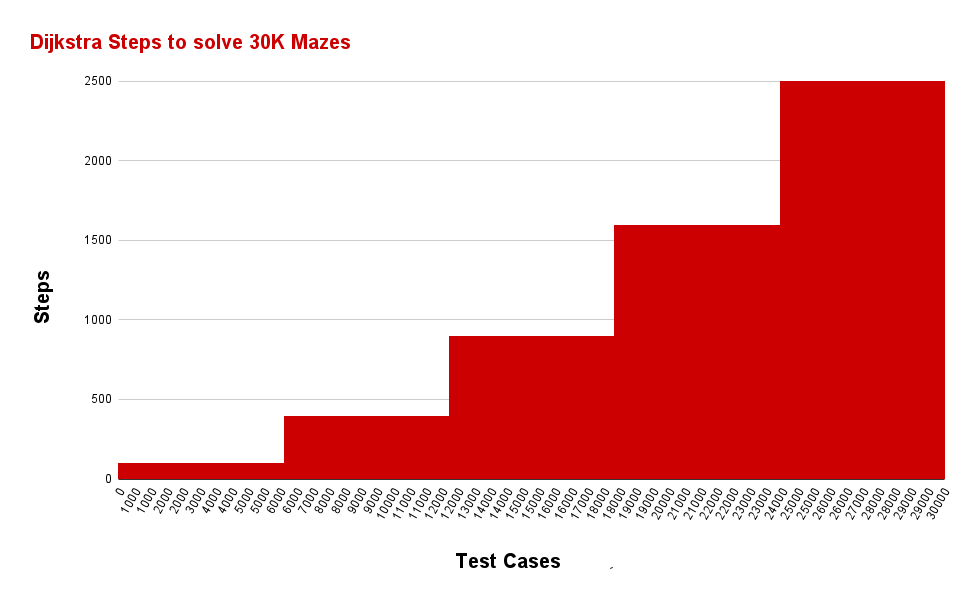
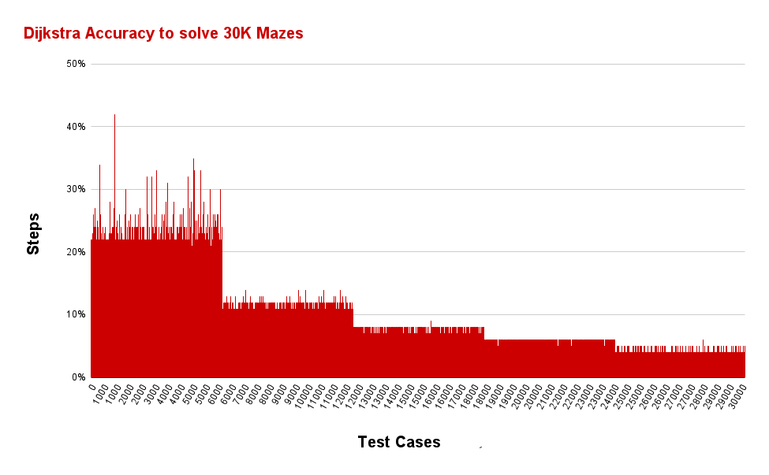
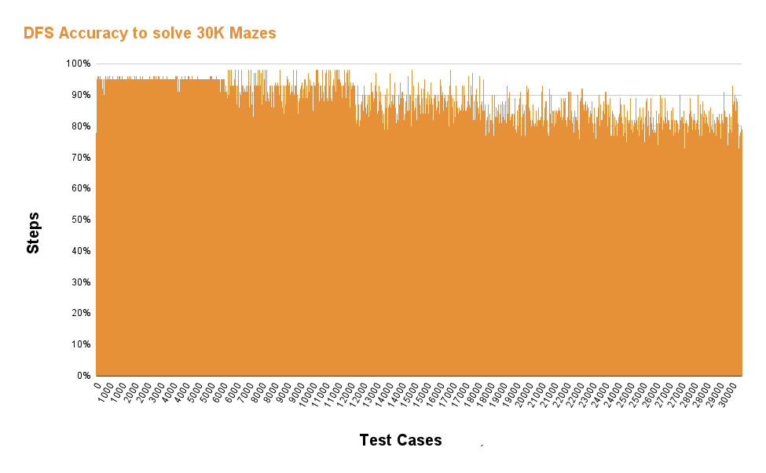

# Mystery-Maze

## Contributors
| Name          | ID      | Contribution   |
|---------------|---------|-----------------|
| Youssef El Shabrawii      | 800161991  | High Contribtutions          |
| Mohamed Sarary    | 800161979  | High Contribtutions          |
| Mohamed Abdo Allam  | 800159903  | High Contribtutions         |
| Mohamed Awadin   | 800160074  | High Contribtutions   |
| Mohamed Fahmy   | 800168127  | High Contribtutions   |
| Mohamed Zahran   | 800161918  | High Contribtutions   |
| Abd El Rahman Ehab   | 800161763  | High Contribtutions   |
| Mohamed Alkoka   | 800167244  | High Contribtutions   |
| Mahmoud Labib   | 803084761  | High Contribtutions   |
| Hany ElEsawy   | 800167243     | High Contribtutions   |

### Overview
This project aims to create maps randomly and implement various search algorithms on them.

  

## Run the project
### See more about how to run the project here : [Running the Project](docs/Run_Project.md)

## Project Description
The main idea for this project is to build a  module that can apply the various search algorithms that we studied throughout this course to a randomly generated map and showcase which algorithm reached the goal first.

This idea has already been implemented in other projects that served as our inspiration. Nevertheless, we aspire to construct this module from scratch on our own.

This module uses the Tkinter GUI framework which is built-in in Python and you do  not need to install any framework to use this module. We used GUI as a way to display how the module work.
Our main objective is to prove the concept that we learned in this course about how informed search more efficient and take less time to reach the goal.

## Case Study 
Throughout this course with Dr. amira Yassien and Eng. Fatma Gamal we learned a lot about searching cases and techniques, so we wanted to pick a specific case study on searching. 
We chose a example on searching which is the grid search.
We put some conditions on the mazes in our study which is:
1. the number of solution changes for the maze like first 1 solution then 10 soluitons then 20 solutions.
2. the sizes of the mazes to be 10x10 or 20x20 or 30x30.

By creating tha maze which will be our grid. It will work as a simulation for graphs in general.
Like when you have graph and you have a starting source and you have a bool that you need to get to with a minimum cost.
In real life this is an example for travelling by car. When you need to get from a city to another you have more than one route to take so you start to search for the fastest route to take.
This data could also be used in designing new roads to reduce the distance between cities.

## Applied Algorithms
- [A-STAR](docs/A-STAR.md)
- [Dijkstra](docs/Dijkstra.md)
- [DFS](docs/DFS.md)
- [BFS](docs/BFS.md)

## GUI
### See more about GUI here : [GUI](docs/GUI.md)
## Results
### See all Reults here : [Results](docs/Maze_results.md)
1. **Maze Generation:**
   The module begins by generating a random maze.

   

2. **Optimal Solution:**
   Users can choose any algorithm to solve the maze, but let's start with optimal solution.

   

3. **A Star:**
   Now let's see How the A* is going to solve the Maze.

   

4. **Dijkstra:**
   When it comes to Dijkstra algorithm it is going to take a while but it will solve the Maze.

   

5. **DFS:**
   Sometimes it is better to start without too much thinking

   

6. **BFS:**
   It seems to be similar to dijkstra but it is not.

   

### Single Maze Solution

Here's an example of the module solving a single random maze using the chosen algorithm. 

### Our Statics
### See more about Statics here : [Statics](docs/Statics.md)

