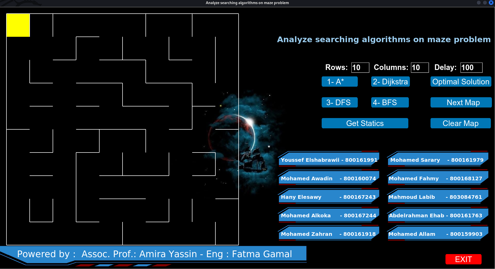
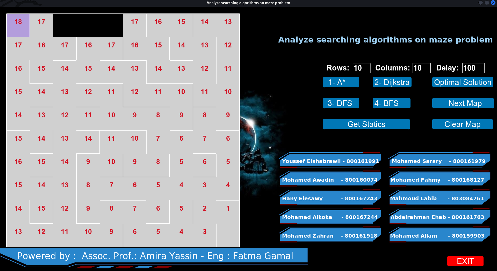
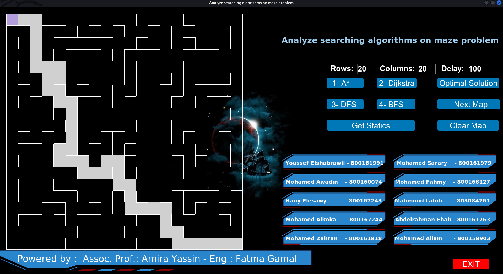
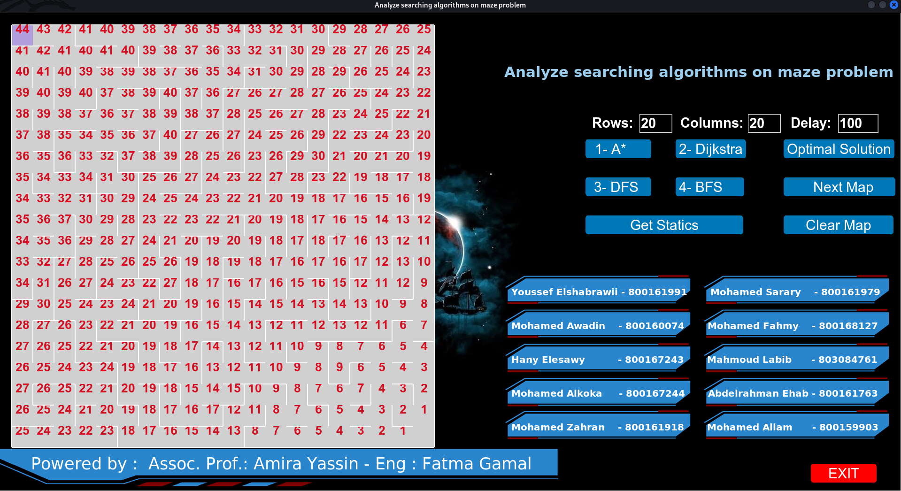

# Multiple Maze Solutions

In this section, you can explore the results of the module solving multiple mazes with various algorithms. We have captured snapshots of the module in action, providing insights into its performance.

## Simple Maze 10x10

## Optimal Solution of it

## Dijkstra Solution of it

## Optimal Solution of 20x20 one

## Dijkstra Solution of it

