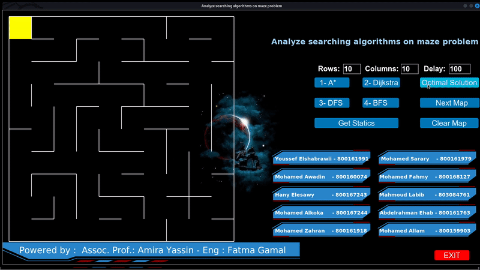
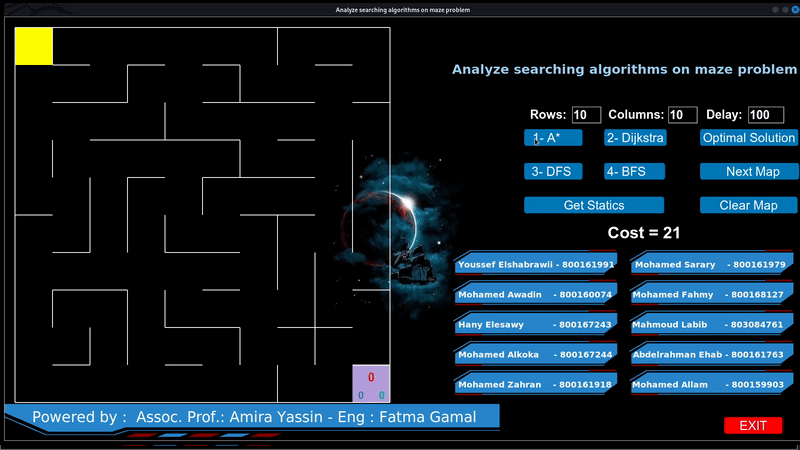
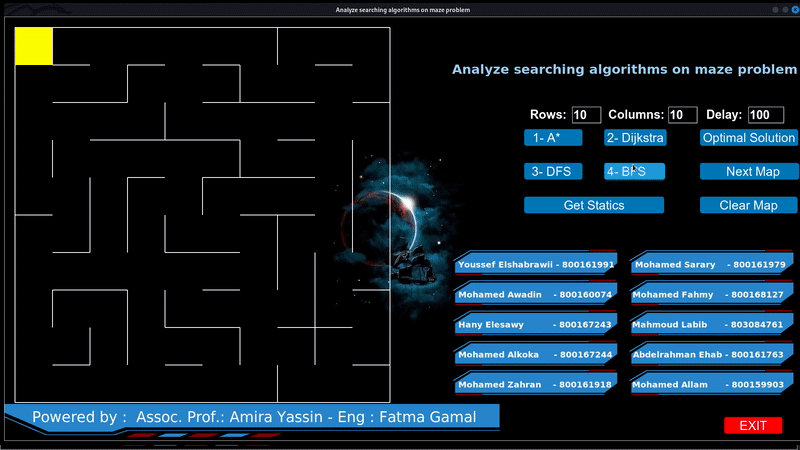

# Multiple Maze Solutions

In this section, you can explore the results of the module solving multiple mazes with various algorithms. We have captured snapshots of the module in action, providing insights into its performance.

1. **Maze Generation:**
   The module begins by generating a random maze.

   

2. **Optimal Solution:**
   Users can choose any algorithm to solve the maze, but let's start with optimal solution.

   

3. **A Star:**
   Now let's see How the A* is going to solve the Maze.

   

4. **Dijkstra:**
   When it comes to Dijkstra algorithm it is going to take a while but it will solve the Maze.

   

5. **DFS:**
   Sometimes it is better to start without too much thinking

   

6. **BFS:**
   It seems to be similar to dijkstra but it is not.

   

## Another results

## Simple Maze 10x10

## Optimal Solution of it

## Dijkstra Solution of it

## Optimal Solution of 20x20 one

## Dijkstra Solution of it

## A Start Solution of it

