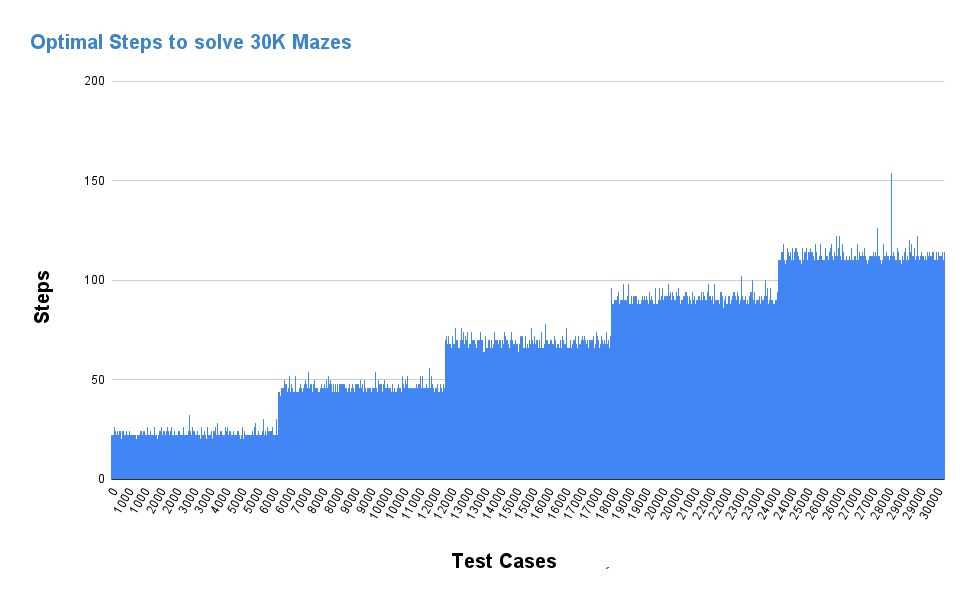
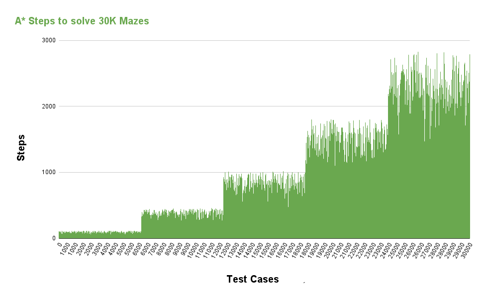
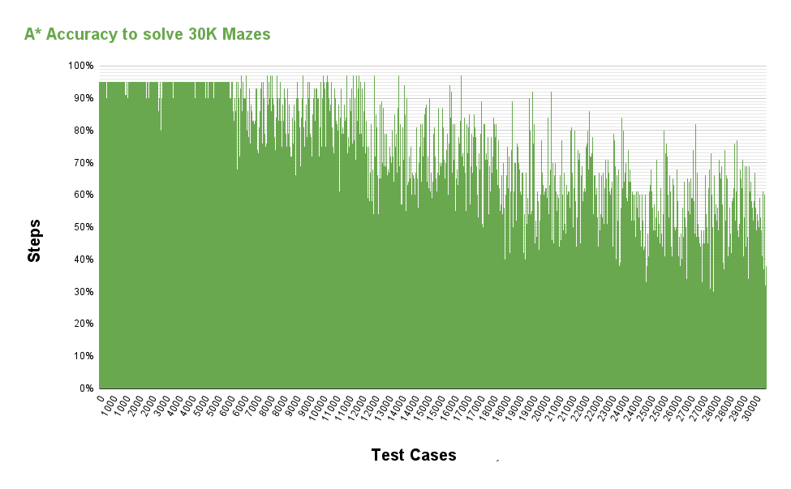
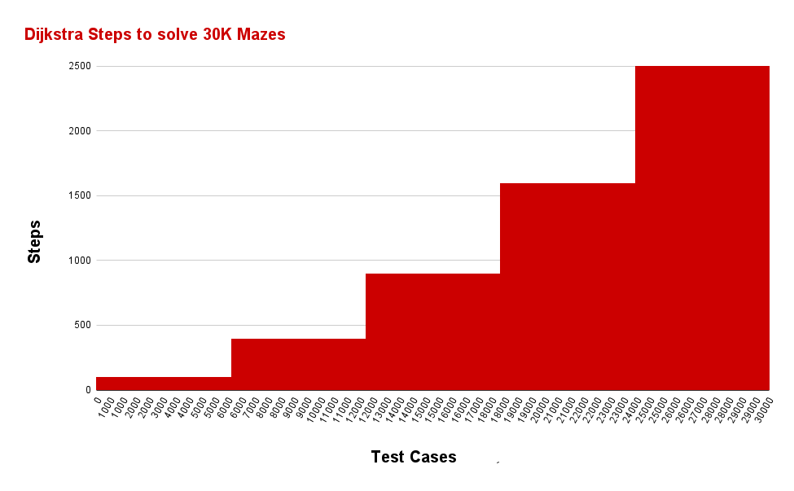
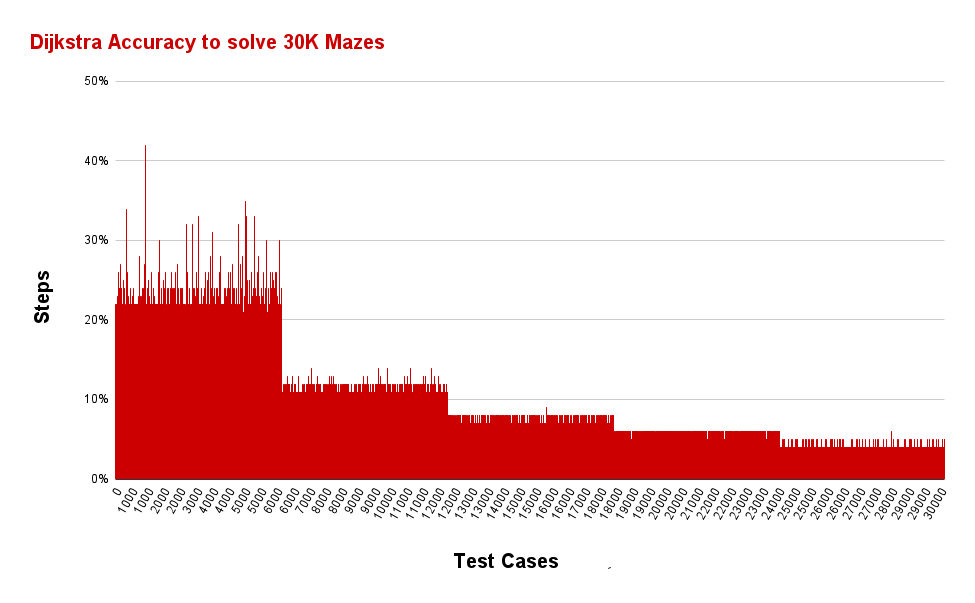
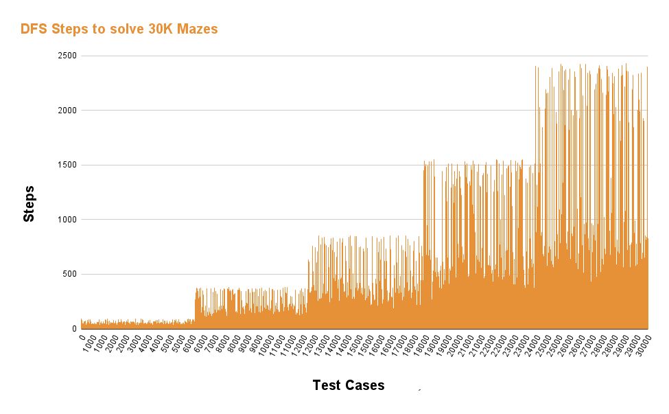
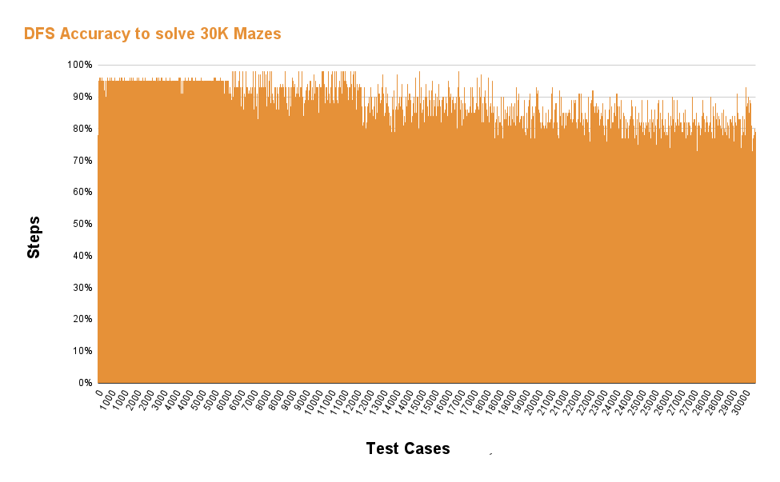
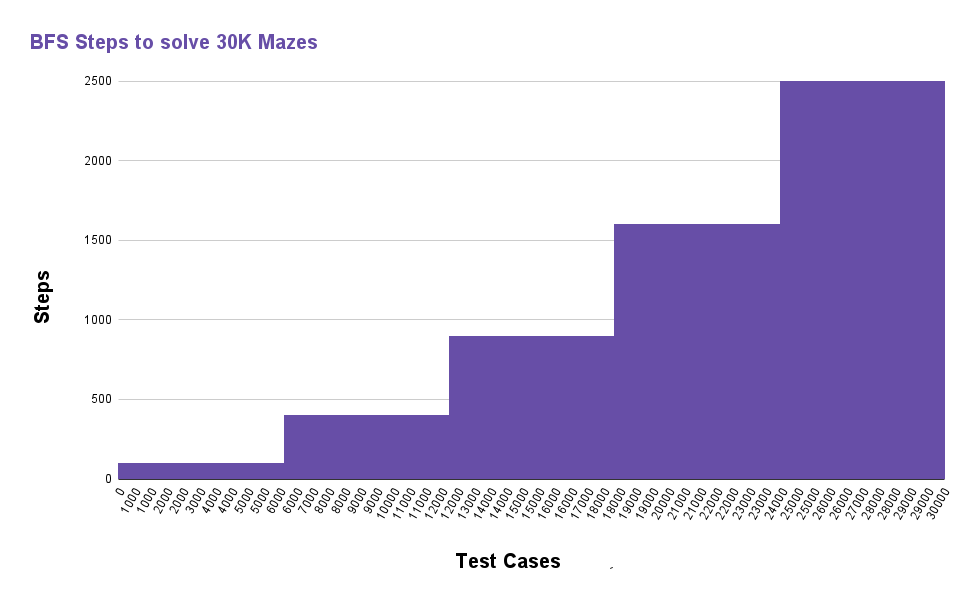
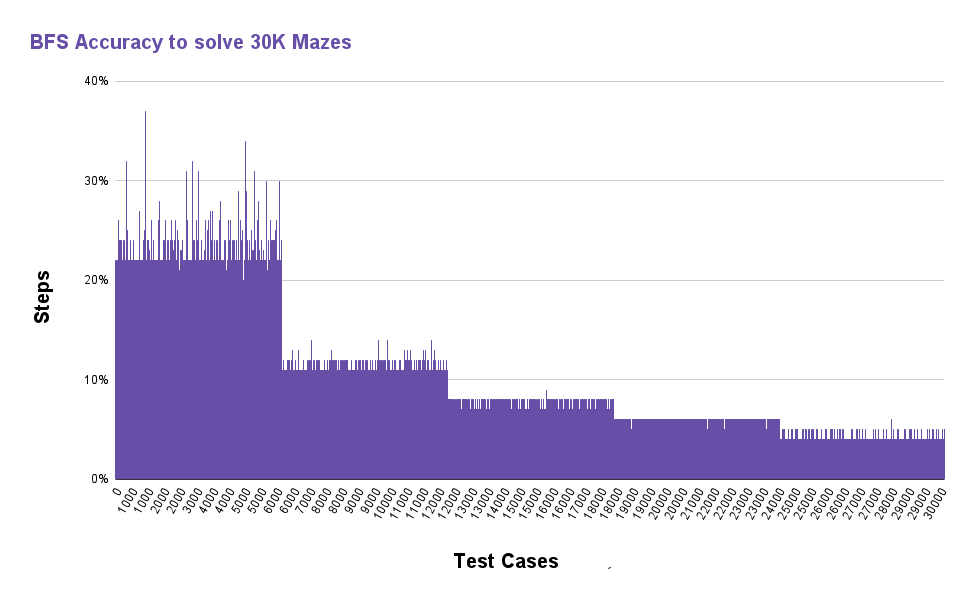

# Statistics

## Contents

- [Statistics](#statistics)
  - [Contents](#contents)
  - [First 5 Lines of results.csv](#first-5-lines-of-resultscsv)
  - [Algorithm Accuracy Evaluation](#algorithm-accuracy-evaluation)
  - [Optimal Solution](#optimal-solution)
    - [Steps](#steps)
    - [Accuracy](#accuracy)
  - [Astar](#astar)
    - [Steps](#steps-1)
    - [Accuracy](#accuracy-1)
  - [Dijkstra](#dijkstra)
    - [Steps](#steps-2)
    - [Accuracy](#accuracy-2)
  - [DFS](#dfs)
    - [Steps](#steps-3)
    - [Accuracy](#accuracy-3)
  - [BFS](#bfs)
    - [Steps](#steps-4)
    - [Accuracy](#accuracy-4)

1. [Optimal Solution](#optimal-solution)
2. [Astar](#astar)
3. [Dijkstra](#dijkstra)
4. [DFS](#dfs)
5. [BFS](#bfs)
---

## First 5 Lines of results.csv

Here are the first 5 lines from the `results.csv` file:

| ID | Maze Size | Optimal | A Star | Accuracy | Dijkstra | Accuracy | DFS | Accuracy | BFS | Accuracy |
|----|-----------|---------|--------|----------|----------|----------|-----|----------|-----|----------|
| 1  | 10x10     | 18      | 35     | 0.51     | 99       | 0.18     | 27  | 0.67     | 100 | 0.18     |
| 2 | 20x20 | 42 | 194 | 0.22 | 397 | 0.11 | 56 | 0.75 | 400 | 0.10 | 
| 3 | 30x30 | 62 | 331 | 0.19 | 896 | 0.07 | 174 | 0.36 | 897 | 0.07 |
| 4 | 40x40 | 92 | 1675 | 0.05 | 1597 | 0.06 | 152 | 0.61 | 1599 | 0.06 |
| 5 | 50x50 | 108 | 990 | 0.11 | 2480 | 0.04 | 184 | 0.59 | 2483 | 0.04 |

---

## Algorithm Accuracy Evaluation

To evaluate the accuracy of each searching algorithm, we use the following formula:

$\text{Accuracy} = 100\% - \text{Error Rate}$

$\text{Error Rate} = \frac{\left| \text{Observed Value} - \text{Actual Value} \right|}{\text{Actual Value}} \times 100%$

Here's a brief explanation of the terms:
- **ID**: The identifier for the maze.
- **Maze Size**: The size of the maze.
- **Optimal**: The optimal steps for the maze.
- **A Star, Dijkstra, DFS, BFS**: The steps taken by each algorithm.
- **Accuracy for each algorithm**: Calculated based on the provided formula.

---

## Optimal Solution

### Steps

*Description: Insert a brief description of the chart and any key insights.*

### Accuracy

*Description: Insert a brief description of the chart and any key insights.*

---

## Astar

### Steps

*Description: Insert a brief description of the chart and any key insights.*

### Accuracy

*Description: Insert a brief description of the chart and any key insights.*

---

## Dijkstra

### Steps

*Description: Insert a brief description of the chart and any key insights.*

### Accuracy

*Description: Insert a brief description of the chart and any key insights.*

---

## DFS

### Steps

*Description: Insert a brief description of the chart and any key insights.*

### Accuracy

*Description: Insert a brief description of the chart and any key insights.*

---

## BFS

### Steps

*Description: Insert a brief description of the chart and any key insights.*

### Accuracy

*Description: Insert a brief description of the chart and any key insights.*

---
